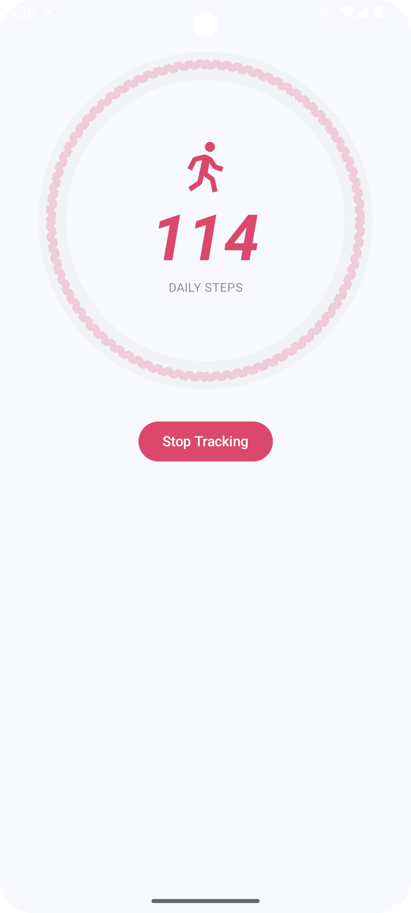

# WalkWise: Step Tracking App

WalkWise is an Android application that tracks your daily steps using the device's built-in sensors. It provides real-time step counting, persistent tracking via a foreground service, and local data storage for your step history.

## Features

- Real-time step counting using Android's Activity Recognition API
- Continuous tracking with a foreground service
- Local storage of step data using Room database
- Modern UI built with Jetpack Compose
- Coroutines for efficient asynchronous operations

## App Preview



*The screenshot above shows the main dashboard of WalkWise, displaying the current step count, daily goal progress, and step history.*

## Technologies Used

- **Kotlin**: The primary programming language
- **Jetpack Compose**: For building the user interface
- **Room**: For local data persistence
- **Coroutines**: For managing background tasks and asynchronous operations
- **Android Sensor Framework**: Specifically, the Step Detector sensor for accurate step counting
- **Foreground Service**: To ensure persistent step tracking even when the app is in the background

## Setup

1. Clone the repository:
   ```
   git clone https://github.com/kunals741/WalkWise.git
   ```
2. Open the project in Android Studio.
3. Build and run the app on your Android device or emulator.

## Project Structure

- `app/src/main/java/com/yourusername/walkwise/`
  - `ui/`: Contains Composable functions for the UI
  - `data/`: Data models and Room database setup
  - `repository/`: Repository pattern implementation
  - `services/`: StepTrackingService for background step counting
  - `viewmodels/`: ViewModel classes for managing UI-related data

## How It Works

1. The app uses a foreground service (`StepTrackingService`) to continuously count steps using the device's Step Detector sensor.
2. Step data is periodically saved to a Room database.
3. The UI, built with Jetpack Compose, displays the current step count and history.
4. Coroutines are used for database operations and sensor data processing to keep the UI responsive.

## Permissions

The app requires the following permissions:

- `ACTIVITY_RECOGNITION`: For accessing step count data
- `FOREGROUND_SERVICE`: For running the step tracking service in the foreground

## Contributing

Contributions are welcome! Please feel free to submit a Pull Request.

## License

This project is licensed under the MIT License - see the [LICENSE.md](LICENSE.md) file for details.

## Acknowledgments

- Thanks to the Android team for providing robust APIs for sensor data and background processing.
- Inspired by health and fitness apps that promote daily activity.
